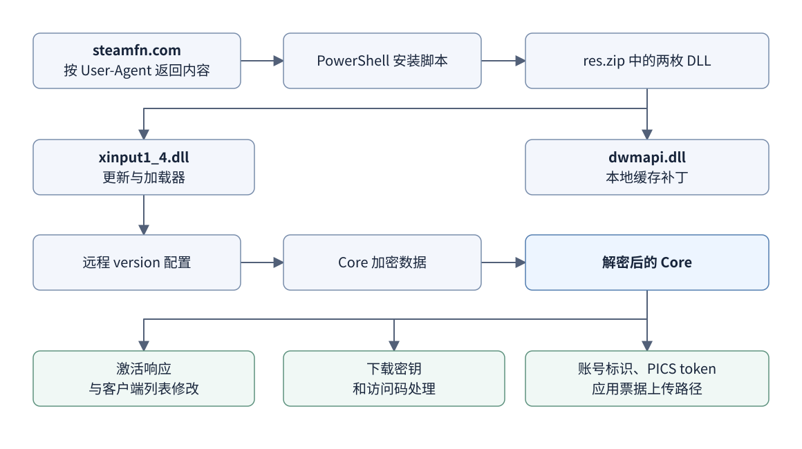

# SteamFn 静态分析报告

对 `steamfn.com` 分发链、`xinput1_4.dll`、`dwmapi.dll` 和远程 Core 的静态分析。采集日期为 **2026-09-30**，结论按样本哈希限定。

## 主要发现

- 网站向带 `WindowsPowerShell` User-Agent 的请求下发安装脚本；普通请求跳转 Steam 商店。
- 安装脚本请求管理员权限，尝试为 Steam 目录添加 Defender 排除项，并安装两枚 DLL。
- `xinput1_4.dll` 挂钩 DLL 加载流程，获取远程配置，解密并在当前进程内映射 Core。相关更新路径关闭 HTTPS 证书及主机名验证，部分地址使用 HTTP。
- `dwmapi.dll` 修改 `packageinfo.vdf` 中首个特定字节匹配，将匹配起点的整数由 **20200 改为 73760**。
- Core 截获产品码并提交第三方 `CardActivate` API，用返回内容重构 Steam 激活响应；还修改客户端游戏列表、Depot 密钥和 Manifest 访问码。
- Core 包含上传账号标识、PICS 应用/包访问令牌和本地应用票据的代码路径。票据收集受远端开关、AppID 名单及本地状态控制，可搜索多个 Steam 账号目录。

这些行为表明其用途是第三方客户端修改与卡密兑换。修改后的客户端成功提示不能单独证明 Valve 已授予账号许可证。已确认的数据上传与更新信任缺陷应分别评估；PICS 访问令牌、应用票据和工具会话不能混称为 Steam 登录密码或登录令牌。

## 阅读顺序

| 报告 | 内容 |
| --- | --- |
| [01 · 网站与安装链](reports/01-site-and-installer.md) | HTTP 响应差异、安装脚本、下载配置、样本身份与方法 |
| [02 · 两枚安装 DLL](reports/02-dlls.md) | 加载触发、更新与内存映射、TLS 验证、缓存补丁及原始指令 |
| [03 · Core 业务逻辑](reports/03-core.md) | 卡密处理、客户端数据修改、访问材料收集与上传 |
| [证据索引](evidence/INDEX.md) | 结论到函数、反编译摘录、原始反汇编和元数据的映射 |

[查看流程图大图](assets/overview.svg) · [Mermaid 源文件](assets/overview.mmd)

## 样本标识

| 文件 | 字节数 | SHA-256 |
| --- | ---: | --- |
| `xinput1_4.dll` | 673,720 | `DDB1F0909C7092F06890674F90B5D4F1198724B05B4BF1E656B4063897340243` |
| `dwmapi.dll` | 136,120 | `1CE49ED63AF004AD37A4D2921A5659A17001C4C0026D6245FCC0D543E9C265D0` |
| 解密后的 Core | 2,142,720 | `FB1E042CD15B2EFA8A1E827B2C1F63BD147ADA4FDF8C85EC7AD464DFD8D88C8D` |

完整入口、节、导入/导出概况与签名结果见 [样本元数据](evidence/metadata/samples.json)。

## 分析方法与适用范围

使用 Ghidra 11.4.1、PE 解析、Capstone 静态反汇编，以及独立实现的数据解密/解压。**未执行安装脚本，未加载或调用目标 DLL、Core 入口或目标解密函数。** 网络操作限于获取公开资源；没有使用用户账号、卡密或本地 Steam 票据测试接口。

地址为各 PE 的首选 VA，ImageBase 均为 `0x180000000`；RVA 等于 VA 减去 ImageBase。反编译文字是分析工具重构的伪代码，语义概述则由分析者整理。关键结论结合原始指令和数据流复核；附件中保留相应标注。

静态代码证明的是实现能力与触发条件，并不证明某次运行实际上传了数据。未验证服务器用途、票据有效性、实际游戏授权、下载成功率或账号接管。Core 存在局部保护/混淆迹象，远端文件也可更新，因此本报告不构成对全部路径或其他版本的完整审计。

仓库收录报告、精选文本证据和 JSON 元数据。未收录目标二进制、下载包、Ghidra 数据库或完整可执行安装脚本。
