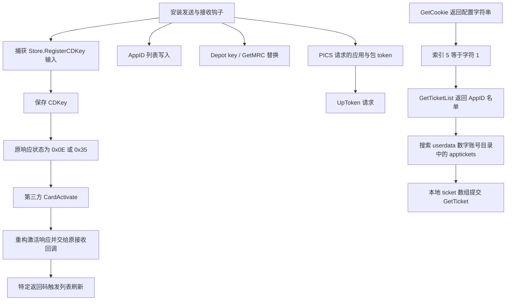

# Core：客户端授权、激活响应与许可材料处理

## 1. 结论与适用样本

`Core.decoded.dll` 是安装链下载的远程 Core 解码后的 PE。其可见业务逻辑包括 Steam 客户端发送/接收钩子、第三方卡密兑换、客户端激活响应重构、AppID 列表写入、Depot 密钥及 Manifest 请求码替换，以及向第三方接口提交账号标识、PICS 访问 token 和本地应用票据。

这些功能已有条件分支、参数构造、调用和内存写入证据，超出了仅依据字符串判断功能的范围。客户端可见的激活结果受到 Core 改写；因此界面“激活成功”无法单独证明账号取得 Valve 后台登记的许可证。已确认的外传材料是账号标识与应用/包许可相关数据，现有证据不足以把它们一概称为 Steam 登录密码、网页登录 Cookie 或登录会话 token。

| 项目 | 值 |
|---|---|
| 样本 | `Core.decoded.dll` |
| SHA-256 | `FB1E042CD15B2EFA8A1E827B2C1F63BD147ADA4FDF8C85EC7AD464DFD8D88C8D` |
| 文件大小 | 2,142,720 字节 |
| 类型 | x64 原生 PE DLL，Machine `0x8664` |
| 首选 ImageBase | `0x180000000` |
| PE 入口 VA / RVA | `0x180157BA0` / `0x157BA0` |
| 分析方式 | PE 字节与数据读取、Ghidra 11.4.1 反编译、Capstone 静态反汇编 |
| 执行边界 | 未加载 DLL、未执行入口或导出函数、未使用目标代码发起网络请求 |

本文所有地址均为样本首选 VA；RVA = VA − `0x180000000`。`FUN_...`、`DAT_...` 是分析工具生成的名称，`CardActivate`、`GetMRC`、`UpToken` 等为样本中的实际方法字符串。下文简化伪代码是对业务逻辑的人工整理，不是原始源代码。原始指令和反编译摘录见各节附件。

## 2. 业务调用关系



图中节点表示代码中存在的路径及其依赖条件；它不表示本次分析期间发生了对应操作。

## 3. C-01：Steam 客户端钩子与第三方协议入口

| 函数 / 数据 | VA | RVA | 作用 |
|---|---|---|---|
| 客户端钩子绑定 | `0x180027E70` | `0x27E70` | 绑定发送回调与接收回调，保存原函数地址 |
| 初始化及配置处理 | `0x1800281A0` | `0x281A0` | 查找模块和接口位置，安装 AppID、Manifest 相关钩子 |
| 发送回调 | `0x18005F330` | `0x5F330` | 解析发送消息，捕获 CDKey 和应用/包 token |
| 接收回调 | `0x18005CEB0` | `0x5CEB0` | 解析接收消息，按方法与状态修改部分响应 |
| 原发送函数指针 | `0x1801EA2C8` | `0x1EA2C8` | 钩子调用原客户端处理函数 |
| 原接收函数指针 | `0x1801EA2E8` | `0x1EA2E8` | 钩子将原始或重构的消息交回客户端 |
| 通用第三方 API 函数 | `0x18003F500` | `0x3F500` | 方法名、请求对象、API base → 工具请求 |

`FUN_180027E70` 在 `0x180027F5C` 取得 `FUN_18005F330` 的地址，在 `0x180028031` 取得 `FUN_18005CEB0` 的地址，并通过钩子帮助函数绑定到扫描所得客户端位置。初始化还使用 `SteamUI.dll` 等模块句柄及代码模式扫描；这些位置取决于客户端版本和当前配置，并非一个固定公开 Steam API。

通用 API 函数将方法名拼入 `/api/` 路径，按方法执行内部序列化，再把请求体、长度及报头列表交给 HTTP 帮助函数 `FUN_18001DEC0`。JSON/cJSON 对象是内部业务参数容器；可见协议分支使用二进制封装，并构造 `Content-Type: application/octet-stream`，因此不能把内部对象直接当作最终线上 JSON 明文。

证据：[钩子与激活反编译摘录](../evidence/decompiled/core-activation.txt)、[钩子与激活汇编](../evidence/assembly/core-activation.txt)、[通用请求及会话反编译摘录](../evidence/decompiled/core-session.txt)、[通用请求及会话汇编](../evidence/assembly/core-session.txt)。

## 4. C-02 / C-03：CDKey 捕获、CardActivate 与响应重构

### 4.1 从客户端请求获取激活码

发送回调 `FUN_18005F330` 将请求的方法名与 `Store.RegisterCDKey#1` 比较。在参数存在、格式满足对应字段标记时，调用 LEB128/变长整数解析帮助函数确定长度与位置，把字符串复制到全局 `DAT_1801E2750`，并记录 `Got CDKey: %s` 日志。

| 关键位置 | VA / RVA | 原始操作 |
|---|---|---|
| 方法名比较 | `0x18005F521` / `0x5F521` | 加载 `Store.RegisterCDKey#1` 字符串；随后调用 `memcmp` |
| CDKey 保存 | `0x18005F59F`—`0x18005F5A9` / `0x5F59F`—`0x5F5A9` | 取全局字符串地址并调用复制帮助函数 |
| CDKey 日志 | `0x18005F5C1` / `0x5F5C1` | 加载 `Got CDKey: %s` 并打印保存的字符串 |
| 保存字符串 / 长度 | `0x1801E2750` / `0x1E2750`；`0x1801E2760` / `0x1E2760` | 后续接收回调读取同一 CDKey 状态 |

```text
// 语义伪代码：省略协议头解析与字符串容器实现
if request.method == "Store.RegisterCDKey#1"
   and parameters_are_present_and_parseable:
    saved_cdkey = read_cdkey_field(request)
    log("Got CDKey: %s", saved_cdkey)
```

这一结论由真实输入字段解析和全局存储链支持，不只是样本含有“CDKey”字样。静态分析没有取得用户实际输入的激活码。

### 4.2 原客户端激活结果触发第三方兑换

接收回调识别 `Store.RegisterCDKey#1` 和 `Store.RegisterCDKey#2`。两条分支均解析原响应中的结果字段，在结果为数值 `0x0E` 或 `0x35`、且保存的 CDKey 长度非零时调用 `FUN_1800320D0`。

该函数创建对象并执行 `cJSON_AddStringToObject(object, "cdkey", input)`，随后调用 `FUN_18003F500(..., "CardActivate", object, apiBase)`。API base 来源于工具配置全局状态；不能仅凭配置另有 `CardUrl` 字段，就断言这次请求直接发送到 `CardUrl`。

| 关键位置 | VA / RVA | 证据意义 |
|---|---|---|
| 构造 `cdkey` 字段 | `0x18003215F` / `0x3215F` | 加载实际字段字符串；`0x180032169` 调用 `cJSON_AddStringToObject` |
| 进入第三方兑换 | `0x18003229B` / `0x3229B` | 加载 `CardActivate`；`0x1800322A7` 调用通用 API |
| 接收分支一兑换 | `0x18005E297` / `0x5E297` | `Store.RegisterCDKey#1` 路径调用 `FUN_1800320D0` |
| 接收分支二兑换 | `0x18005E864` / `0x5E864` | `Store.RegisterCDKey#2` 路径调用同一函数 |
| 兑换响应解析 | `0x1800323E2` / `0x323E2` | 调用返回结构解析帮助函数 `FUN_180049600` |

`FUN_1800320D0` 的返回结构包含结果数值、说明字符串及附加内层数据。本文在伪代码中将它们记作 `code`、`message`、`innerData`，表示字段语义；这些名称不等于已确认的全部线上字段名。

### 4.3 替换送往 Steam 界面的响应

第三方兑换返回后，接收回调检查返回的状态码。返回码并非 `0x0E` 的分支会使用变长整数编码帮助函数 `FUN_180006B20` 重建结果数据，按需要拼接内层数据，再将原协议头与新载荷组合成新消息。长度与分配失败等条件会阻止相应替换。

新消息经原接收函数指针 `DAT_1801EA2E8` 交回客户端。在兑换码为 `0` 或 `9` 的特定分支，代码还会调用列表刷新相关函数 `FUN_18005BE90` 或 `FUN_1800524F0`。随后清空保存的 CDKey。

```text
// 语义伪代码：两个 RegisterCDKey 版本的编码细节不同
if response.method in {"Store.RegisterCDKey#1", "Store.RegisterCDKey#2"}:
    original_code = parse_result(response)
    if original_code in {0x0E, 0x35} and saved_cdkey is not empty:
        tool_result = CardActivate(saved_cdkey, configured_api_base)
        if tool_result.code != 0x0E and rebuilding_succeeds:
            new_payload = encode(tool_result.code, tool_result.innerData)
            original_receive(client, response_header + new_payload)
            if tool_result.code in {0, 9}:
                refresh_client_lists()
            clear(saved_cdkey)
            return
original_receive(client, original_response)
```

原始汇编中 `0x18005E5D2` 和 `0x18005ED6A` 的间接调用位于上述新消息构造后的原接收函数调用路径；`0x18005E5FC` / `0x18005ED8F` 与 `0x18005E613` / `0x18005EDA6` 是相关刷新调用。结合发送捕获、第三方参数构造、响应编码和回调交付，可以确认 Core 能控制此处客户端呈现的激活结果。

**边界：**没有通过执行验证各服务端返回值，也没有审计 Valve 后台。代码修改本地响应这一事实，不足以证明服务端完成正规许可证注册；也不能把第三方所有兑换结果都描述为无条件成功。

证据：[C-02 / C-03 原始反编译摘录](../evidence/decompiled/core-activation.txt)、[C-02 / C-03 原始汇编](../evidence/assembly/core-activation.txt)。

## 5. C-04：AppID 列表写入

初始化 `FUN_1800281A0` 安装日志名为 `UnlockAppId2` 的钩子，回调是 `FUN_18005BC70`，原函数指针保存在 `DAT_1801EA188`。回调先执行原函数，仅在参数结构首字段等于 `0x4EE8` 时进入后续捕获流程。

它保存结构地址 `DAT_1801EA378`，在前 `0x1E` 个整数范围内搜索模式 `{8, 0, 1}`，据此记录数组结构偏移 `DAT_1801E2740`。相关开关 `DAT_1801E9B59` 开启后，回调迭代工具配置条目，并对 ID 大于 `9` 的条目调用 `FUN_18005B840`。

`FUN_18005B840` 读取数组指针、容量和当前数量；容量不足时按约 1.5 倍分配新数组、复制旧元素、释放旧数组，再把 32 位 AppID 写到数组尾部并增加计数。

```text
// 语义伪代码
result = original_unlock_callback(structure)
if structure.tag == 0x4EE8:
    captured_structure = structure
    array_offset = locate_pattern(structure, [8, 0, 1])
    if unlock_configuration_enabled:
        for item in configured_items:
            if item.id > 9:
                append_appid_to_client_array(item.id)
return result

append_appid_to_client_array(appid):
    array = captured_structure + array_offset
    if array.capacity <= array.count:
        new_storage = HeapAlloc(array.capacity * 3 / 2 * sizeof(uint32))
        copy(new_storage, array.storage, array.count * sizeof(uint32))
        HeapFree(array.storage)
        array.storage = new_storage
    array.storage[array.count] = appid
    array.count += 1
```

| 函数 / 数据 | VA / RVA |
|---|---|
| 回调 | `0x18005BC70` / `0x5BC70` |
| 数组写入函数 | `0x18005B840` / `0x5B840` |
| 捕获的客户端结构 | `0x1801EA378` / `0x1EA378` |
| 数组定位偏移 | `0x1801E2740` / `0x1E2740` |
| ID 配置条目范围 | `0x1801E99C8`—`0x1801E99D0` / `0x1E99C8`—`0x1E99D0` |

这是客户端内存列表写入的直接证据。该数组在所有 Steam 版本中的完整语义及写入后的全部界面影响未动态验证；本地列表变化也不能证明账号官方 ownership 改变。

证据：[AppID / Depot 反编译摘录](../evidence/decompiled/core-appid-depot.txt)、[AppID 写入完整短函数及相关汇编](../evidence/assembly/core-appid-depot.txt)。

## 6. C-05 / C-06：Depot 密钥与 Manifest 请求码

### 6.1 Depot key 数据源与响应替换

`FUN_1800603F0` 首先按目标 depot ID 遍历配置表，读取长度恰为 `0x40`（64）字符的密钥字符串。对工具允许处理的 ID，还存在调用 `FUN_180050C70` 查询第三方 `GetDepotsKey` 的分支；该分支取得有效长度的数据后可覆盖用于重构的本地字符串。因此“有本地密钥就必然不请求第三方”的说法不成立。

取得可用数据后，函数将字符串按两字符一组转为十六进制字节，再编码 depot ID 和密钥数据，修改待交回客户端的缓冲区及长度。原始指令在 `0x1800606B1` 将转换进制设为 `0x10`，`0x1800606BF` 调用整数转换帮助函数，`0x1800606D8` 将结果的低字节写入输出缓冲区；这支持“64 字符十六进制 key 转为 32 字节”的判断。

| 函数 | VA / RVA | 作用 |
|---|---|---|
| Depot 响应处理 | `0x1800603F0` / `0x603F0` | 选取 key、十六进制转换和响应重构 |
| 单项 key 查询 | `0x180050C70` / `0x50C70` | 调用 `GetDepotsKey` |
| 批量 key 查询 | `0x180057F10` / `0x57F10` | 批量 `GetDepotsKey` 分支 |
| key 检查 | `0x180058350` / `0x58350` | `CheckDepotKeys` 及相关查询路径 |

```text
// 语义伪代码：实际代码还包含状态、名单与错误处理
key_hex = lookup_configured_key(depot_id, required_length=64)
if depot_id_is_allowed_by_tool_configuration:
    fetched = GetDepotsKey(depot_id, configured_api_base)
    if length(fetched) == 64:
        key_hex = fetched
if usable_key_is_available:
    key_bytes = decode_hex_pairs(key_hex)
    replacement = encode_depot_key_response(depot_id, key_bytes)
    replace_client_response_buffer(replacement)
```

部分旧反编译把通用释放函数误判为不返回，会截断十六进制转换循环。附件没有发布该旧函数体作为完整流程证明；本节转换及后继逻辑以样本原始字节反汇编核对。

### 6.2 GetMRC 替代访问码

初始化安装 `GetManifestRequestCode` 钩子，回调 `FUN_18005C5A0` 保存的原函数指针为 `DAT_1801EA288`。回调先调用原函数；原返回值为数值 `0x0F` 时，且工具处于启用状态、输出指针有效，才进入第三方替代查询。查询最多尝试两次，非零结果写入输出指针并返回 `1`。

`FUN_180051090` 将 manifest ID 转为字符串，构造 `manifest_id` 字段，并按参数情况添加 `appid`、`depot_id`，之后调用通用 API 的 `GetMRC` 方法。发送/接收协议回调另外识别 `ContentServerDirectory.GetManifestRequestCode#1`，相关改写还受工具名单约束。

```text
// 语义伪代码
result = original_GetManifestRequestCode(...)
if result == 0x0F and core_enabled and output_pointer != null:
    repeat at most twice:
        alternate = GetMRC(manifest_id, appid, depot_id, configured_api_base)
        if alternate != 0:
            *output_pointer = alternate
            return 1
return result
```

| 关键位置 | VA / RVA | 操作 |
|---|---|---|
| Manifest 回调 | `0x18005C5A0` / `0x5C5A0` | 调原函数、检查 `0x0F`、写入替代结果 |
| 回调第三方查询调用 | `0x18005C63B` / `0x5C63B` | 调用 `FUN_180051090` |
| 请求构造函数 | `0x180051090` / `0x51090` | manifest、app、depot 参数进入对象 |
| `GetMRC` 方法字符串装载 | `0x180051278` / `0x51278` | 后续进入 `FUN_18003F500` |

证据：[C-05 / C-06 反编译摘录](../evidence/decompiled/core-appid-depot.txt)、[C-05 / C-06 原始汇编](../evidence/assembly/core-appid-depot.txt)。

## 7. C-07：PICS 应用/包访问 token 的来源与提交

### 7.1 来源是客户端产品信息请求

发送回调 `FUN_18005F330` 识别消息数值 `0x22C7`（8903），解析消息中的应用和包条目。原始汇编 `0x18005FA9A` 把 `0x22C7` 装入比较寄存器；同一分支在 `0x18005FF8B` 调用 `FUN_180050680`，将解析出的 ID 与 64 位 token 保存到全局表。

`FUN_180050680` 只保留 ID 和 token 均非零的记录；包记录保存在 `DAT_1801E2680`—`DAT_1801E2688` 的向量范围，应用记录保存在 `DAT_1801E2698`，数量为 `DAT_1801E26A0`。

SteamKit 的项目源代码将消息 8903 定义为 `ClientPICSProductInfoRequest`，其 SteamApps 实现用每个应用或包的 `AccessToken` 请求产品信息。与样本的消息号、条目结构和 64 位字段对照，**将此处材料识别为 PICS 应用/包访问 token 是高置信度类型判断**；该判断包含对外部协议实现的比对。参见 [SteamKit 消息定义](https://raw.githubusercontent.com/SteamRE/SteamKit/master/SteamKit2/SteamKit2/Base/Generated/SteamLanguage.cs)与 [SteamApps 实现](https://raw.githubusercontent.com/SteamRE/SteamKit/master/SteamKit2/SteamKit2/Steam/Handlers/SteamApps/SteamApps.cs)。

### 7.2 UpToken 请求含真实 token 字段

`FUN_180053FD0` 读取上述表，查询本地 SQLite 的 `token`、`packages` 表，筛出未记录的条目；随后创建应用数组与包数组，将 ID 与 token 加入请求对象，再调用 `UpToken`。token 在内部 JSON 参数构造中先转为十进制字符串。

```text
// 语义伪代码；token 是应用/包访问材料
apps = [entry for entry in captured_app_tokens
        if entry.id != 0 and entry.token != 0
        and entry.appid_is_not_recorded_in_local_database]
packages = [entry for entry in captured_package_tokens
            if entry.id != 0 and entry.token != 0
            and entry.packageid_is_not_recorded_in_local_database]
if upload_branch_is_reached:
    request = {
        "appids": [{"appid": id, "token": decimal_string(token)}, ...],
        "packages": [{"packageid": id, "token": decimal_string(token)}, ...]
    }
    api("UpToken", request, configured_api_base)
```

通用序列化函数 `FUN_180046450` 的 UpToken 分支读取应用项的 `appid`、`token`，包项的 `packageid`、`token`，将其整理为二进制请求数据。在 `0x180047A1B` 调用 `FUN_18004B510` 的编码帮助函数，输出再由通用 API 函数封装并交给 HTTP 帮助函数。由此可确认 token 不只是出现在日志或缓存中，而被纳入向工具后端提交的数据。

| 函数 / 关键调用 | VA / RVA |
|---|---|
| 保存捕获 token | `0x180050680` / `0x50680` |
| 筛选、构造 UpToken 对象 | `0x180053FD0` / `0x53FD0` |
| 应用 token 字符串写入 | `0x180054919` / `0x54919` |
| 包 token 字符串写入 | `0x180054A6E` / `0x54A6E` |
| 调用通用 API 的 UpToken | `0x180054C05` / `0x54C05` |
| 请求序列化分发 | `0x180046450` / `0x46450` |

**边界：**这条路径涉及客户端获得的应用/包访问材料，不等于 Steam 账号登录 access token。能否凭这些 token 查询哪些受限产品信息、它们是否仍有效、服务端如何存储和使用，静态代码不能确认。

证据：[token 来源与请求构造反编译摘录](../evidence/decompiled/core-tokens.txt)、[token 消息判断、表写入、UpToken 与序列化汇编](../evidence/assembly/core-tokens.txt)。

## 8. C-08：远端开关控制本地应用票据搜索与提交

### 8.1 GetCookie 返回值作为行为开关

`FUN_180053830` 调用 `FUN_180055410` 获取第三方 `GetCookie` 返回的字符串。后者创建空对象作为调用参数，通过通用 API 请求 `GetCookie`，再由 `FUN_180049A80` 解码返回字符串并缓存。

触发条件可以直接从原始汇编确认：`0x180053B47` 检查返回长度是否大于 `4`，`0x180053B5A` 比较字符串**零基索引 5，即第六个字符**是否等于 `0x31`（`'1'`）；满足后在 `0x180053B64` 调用 `FUN_180057390`。因此该票据收集流程受远端返回配置控制，不能表述成每次启动无条件上传所有票据。

```text
// 语义伪代码：保留样本中的实际长度检查与索引
configuration = GetCookie()
if configuration.length > 4 and configuration[5] == '1':
    collect_requested_local_app_tickets()
```

方法名 `GetCookie` 本身不能证明读取浏览器 Cookie；这条已核对路径的方向是从工具后端取得字符串，并把字符串作为开关使用。

### 8.2 服务端 AppID 名单决定搜索目标

`FUN_180057390` 请求 `GetTicketList`，解析返回的 AppID 名单；逐项查询本地 SQLite `app_list2`，仅对尚未标记的 AppID 进入本地票据查找。

| 关键位置 | VA / RVA | 操作 |
|---|---|---|
| `GetTicketList` 请求 | `0x180057503` / `0x57503` | 调用通用 API 获取目标 AppID 名单 |
| 查询本地标记后的分支 | `0x1800577D7`—`0x1800577DF` / `0x577D7`—`0x577DF` | SQLite 结果数值 `100` 对应已命中记录的跳过路径 |
| 指定 AppID 本地搜索 | `0x1800577EB` / `0x577EB` | 调用 `FUN_18004D4A0` |

### 8.3 userdata 多账号目录与 localconfig.vdf 读取

`FUN_18004D4A0` 枚举相对路径 `userdata\*` 下的目录，排除 `.`、`..` 和非数字名称；随后逐目录拼接 `userdata\<数字目录>\config\localconfig.vdf`。其字符检查调用 `0x1801710C4`，该帮助函数将分类标志 `4` 传给 CRT `iswctype`，对应数字字符检查。

读取链为 `FUN_18004D4A0 → FUN_180019320 → FUN_180019340`。最后一层实际调用 `CreateFileW` 与 `ReadFile`：

```asm
; 摘录：函数入口连续解码所得指令；完整字节及上下文在附件
180019382  mov  dword ptr [rsp + 0x20], 3       ; OPEN_EXISTING
18001938D  mov  edx, 0x80000000                 ; GENERIC_READ
18001939B  call qword ptr [rip + 0x17BF27]      ; CreateFileW
...
180019415  call qword ptr [rip + 0x17BEBD]      ; ReadFile
```

读取的文件内容在 `0x18004DAAF` 载入搜索串 `"apptickets"`，`0x18004DABC` 调用搜索帮助函数，然后在该块中按当前 AppID 定位引号中的票据字符串。命中后返回票据；相应业务返回数据中还保留命中文件路径。

**搜索范围：**它可以搜索这台机器 Steam 目录中保留的多个数字账号资料目录；代码没有把这一搜索限定为当前登录账号。准确描述是“对服务端指定的 AppID，在多个账号目录中寻找命中票据”，而非“上传每个账号的全部票据”。实际覆盖范围还取决于工作目录、文件是否存在、目录内容、权限与解析结果。

### 8.4 本地 ticket 被放入请求数组

回到 `FUN_180057390`，只有返回的字符串长度大于 `0x28`（40）时才加入数组。汇编 `0x1800577FF` 检查长度是否至少 `0x29`（41），与该条件等价。

代码在 `0x180057825` 写入 `appid` 数字字段，在 `0x180057842` 将**查找到的本地字符串**写入 `ticket` 字段，再在 `0x18005784D` 加入数组。数组非空时，在 `0x180057A16` 调用通用 API 的 `GetTicket` 方法。

```text
// 语义伪代码：本地票据来源与上传方向
requested_appids = api("GetTicketList", request_object, configured_api_base)
payload = []
for appid in requested_appids:
    if appid_is_already_marked_in_app_list2:
        continue
    ticket = find_ticket_for_appid_in_userdata_localconfig(appid)
    if ticket.length > 40:
        payload.append({"appid": appid, "ticket": ticket})
if payload is not empty:
    api("GetTicket", payload, configured_api_base)
```

`FUN_180046450` 的 GetTicket 分支显式区分数组和单对象。数组分支循环读取每项的 `appid`、`ticket`，将票据字符串拷入记录；`0x180046FFA` 调用 `FUN_18004B1A0` 编码，输出进入通用请求函数的请求体。这将“本地读取 → 放入对象 → 序列化 → 请求发送帮助函数”串成完整的静态数据流。

### 8.5 同名 GetTicket 的反方向路径

`FUN_180058F70` 还存在另一种用途：检查本地 `HKCU\Software\Valve\Steam\Apps\<appid>\nTicket`，本地缓存不足时以 AppID 请求 `GetTicket`，从响应取得票据并保存到本地。这是下载方向，与上一节本地票据数组提交方向并存。

| 函数 | VA / RVA | 作用 |
|---|---|---|
| 开关触发 | `0x180053830` / `0x53830` | 读取 GetCookie 配置并检查第六字符 |
| GetCookie 获取与缓存 | `0x180055410` / `0x55410` | 第三方返回字符串进入本地内存缓存 |
| 名单获取及票据提交 | `0x180057390` / `0x57390` | GetTicketList → 查找 → GetTicket 数组 |
| 多账号目录票据查找 | `0x18004D4A0` / `0x4D4A0` | 枚举、读取、解析 apptickets |
| 文件读取包装 / 实际读取 | `0x180019320` / `0x19320`；`0x180019340` / `0x19340` | CreateFileW、ReadFile |
| 请求序列化分发 | `0x180046450` / `0x46450` | 将 appid、ticket 记录编码进入请求体 |
| 从远端取得票据并缓存 | `0x180058F70` / `0x58F70` | GetTicket 的下载用途 |

**已确认：**在对应开关与名单条件下，代码读取现有本地应用票据，并把找到的票据字符串作为第三方请求数据提交。**未确认：**实际运行时是否进入此分支、票据有效性、服务端后续分发或用途，以及这些票据能否用于账号接管。本地应用票据不应直接等同 Steam 登录会话。

证据：[票据查找与提交反编译摘录](../evidence/decompiled/core-tickets.txt)、[触发、目录搜索、读文件、上传与序列化汇编](../evidence/assembly/core-tickets.txt)。触发函数、读文件帮助函数及请求序列化的关键证据均包含原始指令，不依赖旧反编译中的不返回误判。

## 9. C-09：SteamID 报头、BeginSession 与工具会话方向

通用请求函数 `FUN_18003F500` 从 `DAT_1801EA038` 读取账号标识。在需要账号标识的协议分支中，使用 `0x110000100000000` 与账号数值构造 SteamID 字符串，并构造 `X-Proto-SteamID: ` 报头。`0x18003F634` 读取全局标识，`0x18003F650` 调用转换帮助函数；`0x1800406A8` 加载实际 SteamID 报头字节。该报头的加入受方法协议分支控制，不能表述为所有请求必然携带。

`FUN_180044E70` 在工具会话检查未通过时，调用 `FUN_18003F500(..., "BeginSession", 0, apiBase)`；请求参数中传入的业务体是空指针。通用请求函数从第三方响应读出 `X-Proto-Session`、`X-Proto-Session-Expires`，缓存会话与到期时间，并在后续合适分支中加入 `X-Proto-Session` 报头。会话缓存路径由 `FUN_1800454F0` 构造，文件名为 `st_sess.dat`。

```text
// 语义伪代码：第三方工具会话
if tool_session_missing_or_expired(account, api_base):
    api("BeginSession", null, api_base)
response_session = read_response_header("X-Proto-Session")
response_expiry  = read_response_header("X-Proto-Session-Expires")
cache_tool_session(response_session, response_expiry)

if method_uses_account_protocol:
    headers.add("X-Proto-SteamID: " + encoded_steamid)
if suitable_cached_tool_session_exists:
    headers.add("X-Proto-Session: " + cached_tool_session)
send_request_with_headers_and_serialized_body()
```

| 关键位置 | VA / RVA |
|---|---|
| 会话建立检查与 BeginSession | `0x180044E70` / `0x44E70` |
| BeginSession 的通用 API 调用 | `0x180044EFC` / `0x44EFC` |
| SteamID 报头常量 | `0x18019A5A0` / `0x19A5A0` |
| 会话报头常量 | `0x18019A5B8` / `0x19A5B8` |
| 解析返回会话字段 | `0x180041785` / `0x41785`；`0x1800417A3` / `0x417A3` |
| 会话路径构造 | `0x1800454F0` / `0x454F0` |
| 主协议请求进入 HTTP 帮助函数 | `0x180040BC3` / `0x40BC3` |

方向上，这是工具向自己的后端建立/复用会话，然后由后端返回工具会话值。现有调用没有把浏览器 Cookie、Steam 登录密码作为 BeginSession 参数传入；不能仅因文件名与报头含“Session”，就称其为 Valve 登录会话。

`GetCookie` 则是工具从远端取得并缓存字符串的路径，随后由 C-08 的条件代码读取。上述会话处理与配置开关共同说明工具对第三方服务有持续依赖；未证明其访问 Chrome/Edge/Firefox Cookie 数据库。

证据：[通用请求、SteamID 与会话反编译摘录](../evidence/decompiled/core-session.txt)、[报头构造、响应读取及 BeginSession 汇编](../evidence/assembly/core-session.txt)。

## 10. C-10：远程配置、分析纠正与结论边界

初始化 `FUN_1800281A0` 处理版本/配置文件中的 `urls`、`AppIdInOnline` 和 `CardUrl`。`urls` 提供 API base 候选；`AppIdInOnline` 提供工具允许处理的 AppID 名单；`CardUrl` 被存入另一个全局字符串。它们与钩子启用和请求目标共同决定行为范围。服务端配置可以改变后端候选和名单，因此一个下载样本中发现的地址不能代表永久固定的服务端边界。证据：[配置字段与钩子反编译摘录](../evidence/decompiled/core-appid-depot.txt)、[相应原始汇编](../evidence/assembly/core-appid-depot.txt)。

分析数据库已纠正 `0x18018E3E0` 复制实现、`0x180157EB0` / `0x180157020` 释放包装的“不返回”属性及调用流覆盖，以保留调用后的可达逻辑；目标样本字节未修改。附件使用纠正后的业务导出，并以原始汇编补足触发、读取、编码及后续循环证据。

PE 中存在约 66 KB 的 `.vmp0` 节，部分代码与模式串有局部保护或混淆迹象。该节名不构成恶意性判定，也不代表所有函数已解混淆或整个 Core 已完整审计。

| 判断层次 | 本报告支持的内容 |
|---|---|
| 直接静态确认 | CDKey 捕获与第三方提交；激活响应重构；客户端 AppID 数组写入；Depot key 与 GetMRC 替换；token 和应用票据进入第三方请求数据；账号标识报头；远端字符串控制票据收集条件 |
| 基于协议比对的类型判断 | 消息 8903 的应用/包 64 位 token 属于 PICS 产品信息访问材料 |
| 未通过执行确认 | 当前服务端是否启用收集、返回哪些 AppID、实际是否联网、请求结果、票据/token 有效性、Steam 当前版本兼容性与界面变化 |
| 现有路径未证明 | Steam 密码或浏览器登录 Cookie 采集、Valve 登录 access/refresh token 盗取；不能由已确认的应用票据/PICS token 上传推导出账号接管 |
| 服务端不可见事项 | 第三方对收到的票据/token 的存储、共享、分发、交易及后续使用 |

“未证明”表示本次静态证据不能支持对应结论，不是安全保证。报告对应本文所列 SHA-256 的样本；远端 Core 更新后的内容和行为需要按新哈希重新分析。

## 11. Core 证据导航

| 证据编号 | 主题 | 原始反编译摘录 | 原始汇编 |
|---|---|---|---|
| C-01—C-03 | 发送/接收钩子、CDKey、CardActivate、响应重构 | [core-activation.txt](../evidence/decompiled/core-activation.txt) | [core-activation.txt](../evidence/assembly/core-activation.txt) |
| C-04—C-06、C-10 配置 | AppID 写入、Depot、GetMRC、配置与钩子 | [core-appid-depot.txt](../evidence/decompiled/core-appid-depot.txt) | [core-appid-depot.txt](../evidence/assembly/core-appid-depot.txt) |
| C-07 | PICS token 来源、表写入、UpToken 与编码 | [core-tokens.txt](../evidence/decompiled/core-tokens.txt) | [core-tokens.txt](../evidence/assembly/core-tokens.txt) |
| C-08 | GetCookie 开关、GetTicketList、本地票据来源与双向 GetTicket | [core-tickets.txt](../evidence/decompiled/core-tickets.txt) | [core-tickets.txt](../evidence/assembly/core-tickets.txt) |
| C-09、C-01 请求封装 | SteamID 报头、BeginSession、工具会话与 HTTP 请求 | [core-session.txt](../evidence/decompiled/core-session.txt) | [core-session.txt](../evidence/assembly/core-session.txt) |

复核时宜先依据函数 VA 和关键调用地址定位汇编，再对照业务摘录。附件是精选证据，不是全量反编译或可执行样本，也不包含本机实际账号、票据或激活码值。
